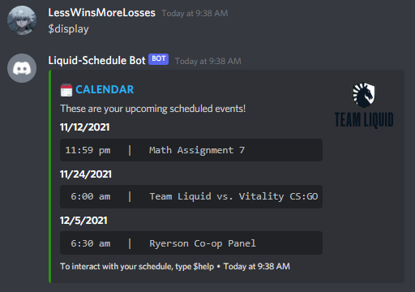

# Project Overview: # 

If you ever needed to stay on top of your homework or don't want to miss any important meetings, this discord bot is for you! 
This discord bot allows users to create a schedule for themselves within the app itself.

 
 

## Example Schedule: ##

 

 
 

## Link To Github Repository: ##

>[Discord Scheduling Bot Project Link](https://github.com/ArjenArumalingam/Discord-Liquid-Hacks_2.0 "Discord Scheduling Bot Project Link")

 
 

 ## Contact Information: ##
 

>Name: Arjen Arumalingam  
>Email: arjen.aruma@gmail.com  
>Github: https://github.com/ArjenArumalingam  
>Linkedin: https://www.linkedin.com/in/arjenarumalingam/  

>Name: Taskin Rahman   
>Email: navid.rahman@ryerson.ca  
>Github: https://github.com/navidr08-hub  
>LinkedIn: https://www.linkedin.com/in/navid-rahman-28b1521b6  

>Name: Yadu Krishnan Madhu  
>Email: yaduyem@gmail.com  
>Github: https://github.com/Yadu-M  
>Linkedin: https://www.linkedin.com/in/yadu-krishnan-madhu-700951186/  

>Name: Altaaf Ahmed Jahankeer  
>Email: ajahankeer@ryerson.ca  
>Github: https://github.com/altaafj  
>LinkedIn: https://www.linkedin.com/in/altaafj/

